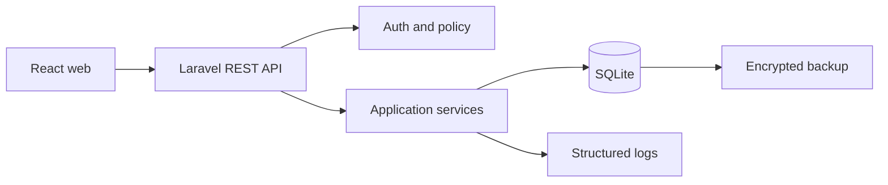

# Architecture

## Keputusan
Arsitektur usulan: monolith modular Laravel dengan REST API, React + Tailwind, SQLite, dan Docker Compose untuk development. Microservices, AI, layanan berbayar, dan infrastruktur rumit dihindari karena belum ada kebutuhan atau bukti volume. Fondasi yang terpasang saat ini adalah Laravel 13.33 pada PHP 8.4, React 19.3, Tailwind CSS 4.3, Vite 8.3, dan SQLite 3. Lockfile menjadi sumber versi persis; upgrade mayor harus melalui pemeriksaan kompatibilitas dan pengujian.

## Diagram


## Modul
`IdentityAccess`: user, role, policy; `Catalog`: menu, ingredient, unit, recipe version; `Ordering`: order, item, requirement, status; `Inventory`: balance, movement, allocation; `Production`: queue, production, usage; `Reporting`: read models/query; `Audit`: audit and idempotency. Modul berkomunikasi melalui service/domain contract internal, bukan memanggil tabel modul lain sembarang.

## Struktur folder usulan
```text
app/Domain/{IdentityAccess,Catalog,Ordering,Inventory,Production,Reporting,Audit}
app/Http/Controllers/Api/V1
app/Http/Requests
app/Policies
database/migrations database/seeders tests/Feature tests/Unit
resources/js/{pages,components,services}
routes/api.php docker-compose.yml
```

Validasi bentuk request berada di Form Request; authorization di Policy/permission middleware; aturan dan transaksi di application service/domain; query laporan di Reporting. Controller hanya orchestration dan response mapping.

Dependensi modul diarahkan melalui application service: `Ordering` membaca kontrak `Catalog`, `Inventory` menangani saldo/alokasi, dan `Production` memanggil operasi penggunaan milik `Inventory`. Tidak ada controller atau modul yang mengubah saldo dengan query langsung. Event internal setelah commit boleh memperbarui read model laporan, tetapi ledger dan saldo inti tetap sinkron.

## Keamanan dan operasi
Password di-hash framework; session cookie, CSRF, rate limit login, least privilege, validasi input, output escaping, HTTPS production, secret lewat environment/secret store, dan tidak ada secret di dokumentasi. Log berisi request ID, actor, route, durasi, dan error tanpa password atau data sensitif. Error internal dipetakan ke pesan umum.

Backup file SQLite terjadwal, terenkripsi, dan diuji restore di environment terpisah. Backup harus dibuat melalui mekanisme backup SQLite agar snapshot konsisten. Frekuensi, retensi, RPO, dan RTO menunggu V-13/V-14 dan tidak boleh ditebak. Migration production dijalankan terkontrol setelah backup dan memiliki rencana rollback/forward-fix.

## Environment dan deployment minimum

| Environment | Tujuan | Data dan kontrol |
|---|---|---|
| Development | Pengembangan lokal melalui Docker Compose | fixture ilustratif; debug lokal; secret di `.env` yang tidak di-commit |
| Testing/CI | Unit, feature, integration, dan concurrency test | database terisolasi yang dibuat ulang; tidak memakai data pribadi |
| Staging/UAT | UAT dan latihan deployment | data anonim/sintetis; konfigurasi mendekati production; akses terbatas |
| Production | Operasional | debug mati, HTTPS, backup, monitoring, least privilege, dan data demo dilarang |

Deployment minimum adalah satu host aplikasi yang menjalankan web server, PHP/Laravel, build statis React, dan file SQLite pada storage persisten. Wajib ada HTTPS, health check aplikasi/database, log rotation, backup terjadwal, sinkronisasi waktu, dan prosedur restore. Spesifikasi CPU/RAM/storage baru ditentukan setelah volume V-03 dan anggaran/perangkat V-13 tersedia.

## Queue dan realtime
MVP tidak memerlukan queue untuk transaksi inti karena konsistensi harus selesai sinkron. Queue boleh dipakai kemudian untuk ekspor laporan/notifikasi yang tidak menentukan saldo. Realtime tidak wajib; layar dapur dapat polling/refresh terkontrol sampai kebutuhan dan jaringan divalidasi.
