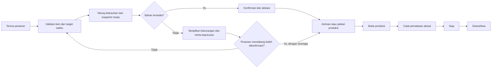
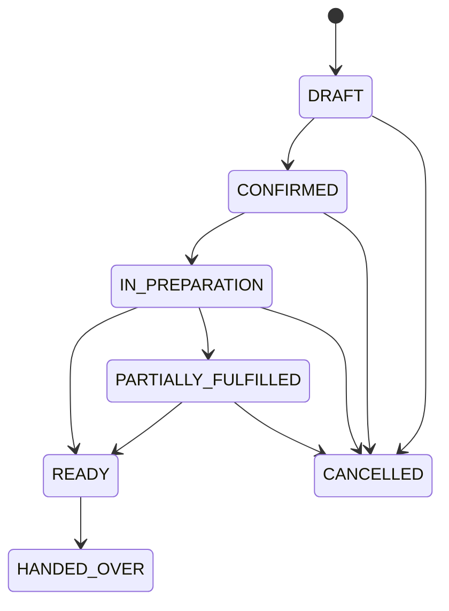

# Business Process

## Status pengetahuan
### Fakta yang diketahui
Pelanggan langsung memesan lalu makanan dimasak; Silih Asih juga menerima katering; aplikasi ditujukan untuk menghubungkan pesanan, bahan, dan dapur.

### Yang belum diketahui
Apakah dapur, alat, pekerja, dan persediaan dipakai bersama; siapa menerima pesanan; kapan katering dikunci; cara menentukan urutan; dan bagaimana perubahan, pembatalan, atau stok dicatat saat ini. Alur di bawah adalah usulan, bukan hasil observasi.

## Alur usulan

## Pesanan langsung
Kasir membuat draft; sistem memvalidasi menu aktif dan jumlah; pengguna berwenang mengonfirmasi; sistem membuat kebutuhan dan alokasi; dapur mengurutkan berdasarkan target waktu, prioritas manual, dan kapasitas; petugas memulai, mencatat pemakaian, menyelesaikan; kasir menandai siap diserahkan. Jika stok kurang, pengguna memilih menunggu, mengurangi item, atau membatalkan sesuai aturan yang dikonfirmasi.

## Pesanan katering
Kasir mengisi tanggal/jam pemenuhan dan jumlah; sistem menghitung kebutuhan total; bahan tersedia dialokasikan, kekurangan menjadi kebutuhan pengadaan; pemilik atau pengguna berwenang menyetujui jadwal; dapur melihat jadwal dan batch; pemakaian aktual dicatat; pesanan ditandai siap dan diserahkan. Katering tidak boleh diasumsikan otomatis memiliki prioritas lebih tinggi.

## Sumber daya bersama
Jika validasi membuktikan sumber daya bersama, satu alokasi persediaan dan antrean kapasitas harus memperhitungkan kedua jenis pesanan. Jika terpisah, gunakan lokasi/stok terpisah atau kebijakan eksplisit. Sistem tidak memilih salah satu tanpa keputusan pemilik.

## Perubahan, pembatalan, kekurangan, parsial
Perubahan sebelum produksi menghitung delta kebutuhan dan menyesuaikan alokasi dalam satu transaksi. Setelah produksi dimulai, perubahan hanya boleh dilakukan oleh peran berwenang dan harus menghasilkan catatan; item yang sudah dibuat tidak dibatalkan secara diam-diam. Pembatalan sebelum produksi melepas alokasi yang belum dipakai. Pembatalan setelah produksi dimulai tetap dapat dilakukan dengan permission dan alasan khusus: hanya sisa alokasi dilepas, sedangkan pemakaian dan hasil yang sudah dibuat dipertahankan. Pesanan parsial menyimpan item, jumlah yang selesai, dan alasan pada catatan fulfillment.

## Prioritas yang dapat dijalankan
Urutan default usulan: target waktu terdekat, lalu prioritas manual, lalu waktu konfirmasi paling awal. Pengguna dapur berwenang dapat mengubah urutan dan wajib mengisi alasan. Pesanan katering memakai target serah terima dan waktu buffer yang disepakati. Sistem menampilkan konflik kapasitas tetapi tidak menjanjikan keterlambatan dapat dihilangkan.

## Matriks tanggung jawab
| Aktivitas | OWNER_ADMIN | ORDER_CLERK | KITCHEN | INVENTORY |
|---|---:|---:|---:|---:|
| Master dan resep | A/R | I | C | C |
| Buat/ubah pesanan | A | R | I | I |
| Konfirmasi dan batal | A | R* | C | I |
| Antrean dan produksi | A | I | R | C |
| Terima dan koreksi stok | A | I | C | R |
| Laporan dan audit | R | I | I | C |

`R*` hanya bila permission diberikan; A=accountable, R=responsible, C=consulted, I=informed.

## Transisi status

Status produksi terpisah: `NOT_STARTED -> IN_PROGRESS -> PARTIAL/COMPLETED`; `NOT_STARTED` atau `IN_PROGRESS` dapat menjadi `CANCELLED` mengikuti pembatalan pesanan. Status pembayaran, bila masuk cakupan, juga berdiri sendiri.
