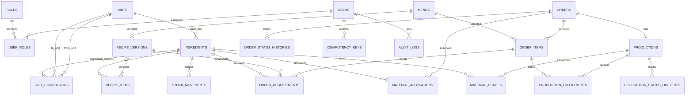

# Database Design

SQLite adalah database yang digunakan. Nama field pada dokumen ini menjadi kontrak bagi [api.md](api.md). ID UUID dan waktu ISO 8601 UTC disimpan sebagai `TEXT`. Kuantitas serta nilai uang disimpan sebagai `NUMERIC`; presisi tiga dan dua desimal divalidasi pada aplikasi karena SQLite tidak membatasi skala `NUMERIC`. Foreign key, constraint domain, dan partial unique index tetap ditegakkan oleh database.

## ERD

## Tabel identitas dan master

| Tabel | Kolom dan constraint |
|---|---|
| `users` | `id uuid PK`; `name varchar(120) NOT NULL`; `email varchar(255) NOT NULL UNIQUE`; `password_hash varchar(255) NOT NULL`; `active boolean NOT NULL DEFAULT true`; `created_at`, `updated_at timestamptz NOT NULL` |
| `roles` | `id uuid PK`; `code varchar(40) NOT NULL UNIQUE CHECK (code IN ('OWNER_ADMIN','ORDER_CLERK','KITCHEN','INVENTORY'))`; `name varchar(100) NOT NULL` |
| `user_roles` | `user_id uuid NOT NULL FK users ON DELETE CASCADE`; `role_id uuid NOT NULL FK roles ON DELETE RESTRICT`; `PRIMARY KEY (user_id, role_id)` |
| `units` | `id uuid PK`; `code varchar(20) NOT NULL UNIQUE`; `name varchar(60) NOT NULL`; `dimension varchar(20) NOT NULL CHECK (dimension IN ('MASS','VOLUME','COUNT','LENGTH','OTHER'))`; `decimal_places smallint NOT NULL DEFAULT 3 CHECK (decimal_places BETWEEN 0 AND 6)`; `active boolean NOT NULL DEFAULT true`; `created_at`, `updated_at timestamptz NOT NULL` |
| `ingredients` | `id uuid PK`; `code varchar(40) NOT NULL UNIQUE`; `name varchar(120) NOT NULL`; `base_unit_id uuid NOT NULL FK units ON DELETE RESTRICT`; `purchase_unit_id uuid NULL FK units ON DELETE RESTRICT`; `purchase_pack_quantity numeric(14,3) NULL CHECK (> 0)`; `physical_quantity numeric(14,3) NOT NULL DEFAULT 0 CHECK (>= 0)`; `allocated_quantity numeric(14,3) NOT NULL DEFAULT 0 CHECK (>= 0 AND allocated_quantity <= physical_quantity)`; `active boolean NOT NULL DEFAULT true`; `created_at`, `updated_at timestamptz NOT NULL` |
| `unit_conversions` | `id uuid PK`; `ingredient_id uuid NULL FK ingredients ON DELETE RESTRICT`; `from_unit_id uuid NOT NULL FK units`; `to_unit_id uuid NOT NULL FK units`; `factor numeric(18,8) NOT NULL CHECK (> 0)`; `source_note text NOT NULL`; `verified_by uuid NOT NULL FK users`; `verified_at timestamptz NOT NULL`; `active boolean NOT NULL DEFAULT true`; `CHECK (from_unit_id <> to_unit_id)` |
| `menus` | `id uuid PK`; `code varchar(40) NOT NULL UNIQUE`; `name varchar(120) NOT NULL`; `active boolean NOT NULL DEFAULT true`; `created_at`, `updated_at timestamptz NOT NULL` |
| `recipe_versions` | `id uuid PK`; `menu_id uuid NOT NULL FK menus ON DELETE RESTRICT`; `version_no integer NOT NULL CHECK (> 0)`; `recipe_type varchar(20) NOT NULL CHECK (recipe_type IN ('PER_PORTION','PER_BATCH'))`; `yield_quantity numeric(14,3) NOT NULL CHECK (> 0)`; `yield_unit_id uuid NOT NULL FK units`; `active boolean NOT NULL DEFAULT false`; `created_by uuid NOT NULL FK users`; `created_at timestamptz NOT NULL`; `UNIQUE (menu_id, version_no)`; maksimal satu versi aktif per menu melalui partial unique index |
| `recipe_items` | `id uuid PK`; `recipe_version_id uuid NOT NULL FK recipe_versions ON DELETE RESTRICT`; `ingredient_id uuid NOT NULL FK ingredients ON DELETE RESTRICT`; `quantity numeric(14,3) NOT NULL CHECK (> 0)`; `unit_id uuid NOT NULL FK units`; `UNIQUE (recipe_version_id, ingredient_id)` |

Untuk `PER_PORTION`, `yield_quantity` menyatakan jumlah porsi yang dihasilkan resep, umumnya 1. Untuk `PER_BATCH`, nilainya menyatakan hasil satu batch. Aplikasi memastikan satuan resep dapat dikonversi ke `ingredients.base_unit_id` sesuai BR-07.

## Tabel pesanan dan produksi

| Tabel | Kolom dan constraint |
|---|---|
| `orders` | `id uuid PK`; `order_number varchar(40) NOT NULL UNIQUE`; `order_type varchar(20) NOT NULL CHECK (order_type IN ('DIRECT','CATERING'))`; `customer_name varchar(120) NULL`; `target_at timestamptz NOT NULL`; `order_status varchar(30) NOT NULL DEFAULT 'DRAFT' CHECK (order_status IN ('DRAFT','CONFIRMED','IN_PREPARATION','PARTIALLY_FULFILLED','READY','HANDED_OVER','CANCELLED'))`; `payment_status varchar(20) NULL CHECK (payment_status IN ('UNPAID','PARTIAL','PAID','REFUNDED'))`; `notes text NULL`; `created_by uuid NOT NULL FK users`; `confirmed_at`, `ready_at`, `handed_over_at`, `cancelled_at timestamptz NULL`; `cancelled_by uuid NULL FK users`; `cancellation_reason text NULL`; `lock_version bigint NOT NULL DEFAULT 0`; `created_at`, `updated_at timestamptz NOT NULL` |
| `order_items` | `id uuid PK`; `order_id uuid NOT NULL FK orders ON DELETE RESTRICT`; `menu_id uuid NOT NULL FK menus ON DELETE RESTRICT`; `menu_name_snapshot varchar(120) NOT NULL`; `quantity numeric(14,3) NOT NULL CHECK (> 0)`; `fulfilled_quantity numeric(14,3) NOT NULL DEFAULT 0 CHECK (>= 0 AND fulfilled_quantity <= quantity)`; `notes text NULL`; `unit_price numeric(14,2) NULL CHECK (unit_price >= 0)` |
| `order_requirements` | `id uuid PK`; `order_item_id uuid NOT NULL FK order_items ON DELETE RESTRICT`; `ingredient_id uuid NOT NULL FK ingredients ON DELETE RESTRICT`; `recipe_version_id uuid NOT NULL FK recipe_versions ON DELETE RESTRICT`; `source_quantity numeric(14,3) NOT NULL CHECK (> 0)`; `source_unit_id uuid NOT NULL FK units`; `conversion_factor numeric(18,8) NOT NULL CHECK (> 0)`; `required_quantity numeric(14,3) NOT NULL CHECK (> 0)`; `rounding_mode varchar(20) NOT NULL CHECK (rounding_mode IN ('NONE','UP','NEAREST'))`; `rounded_quantity numeric(14,3) NOT NULL CHECK (> 0)`; `base_unit_id uuid NOT NULL FK units`; `shortage_quantity numeric(14,3) NOT NULL DEFAULT 0 CHECK (>= 0)`; `UNIQUE (order_item_id, ingredient_id)` |
| `material_allocations` | `id uuid PK`; `order_id uuid NOT NULL FK orders ON DELETE RESTRICT`; `ingredient_id uuid NOT NULL FK ingredients ON DELETE RESTRICT`; `allocated_quantity numeric(14,3) NOT NULL CHECK (> 0)`; `consumed_quantity numeric(14,3) NOT NULL DEFAULT 0 CHECK (>= 0)`; `released_quantity numeric(14,3) NOT NULL DEFAULT 0 CHECK (>= 0)`; `status varchar(20) NOT NULL DEFAULT 'ACTIVE' CHECK (status IN ('ACTIVE','RELEASED','CLOSED'))`; `created_at`, `updated_at timestamptz NOT NULL`; `CHECK (consumed_quantity + released_quantity <= allocated_quantity)` |
| `productions` | `id uuid PK`; `order_id uuid NOT NULL UNIQUE FK orders ON DELETE RESTRICT`; `production_status varchar(20) NOT NULL DEFAULT 'NOT_STARTED' CHECK (production_status IN ('NOT_STARTED','IN_PROGRESS','PARTIAL','COMPLETED','CANCELLED'))`; `started_at`, `completed_at timestamptz NULL`; `notes text NULL`; `lock_version bigint NOT NULL DEFAULT 0`; `created_at`, `updated_at timestamptz NOT NULL` |
| `production_fulfillments` | `id uuid PK`; `production_id uuid NOT NULL FK productions ON DELETE RESTRICT`; `order_item_id uuid NOT NULL FK order_items ON DELETE RESTRICT`; `quantity numeric(14,3) NOT NULL CHECK (> 0)`; `recorded_by uuid NOT NULL FK users`; `recorded_at timestamptz NOT NULL`; `reason text NULL` |
| `material_usages` | `id uuid PK`; `production_id uuid NOT NULL FK productions ON DELETE RESTRICT`; `ingredient_id uuid NOT NULL FK ingredients ON DELETE RESTRICT`; `source_quantity numeric(14,3) NOT NULL CHECK (> 0)`; `source_unit_id uuid NOT NULL FK units`; `conversion_factor numeric(18,8) NOT NULL CHECK (> 0)`; `quantity numeric(14,3) NOT NULL CHECK (> 0)` dalam base unit; `reason text NULL`; `created_by uuid NOT NULL FK users`; `idempotency_key_id uuid NOT NULL UNIQUE FK idempotency_keys`; `created_at timestamptz NOT NULL` |

`payment_status` tetap `NULL` dan tidak ditampilkan apabila pembayaran sederhana tidak disetujui melalui V-12.

## Ledger, histori, dan kontrol

| Tabel | Kolom dan constraint |
|---|---|
| `stock_movements` | `id uuid PK`; `ingredient_id uuid NOT NULL FK ingredients ON DELETE RESTRICT`; `movement_type varchar(20) NOT NULL CHECK (movement_type IN ('RECEIPT','USAGE','WASTE','ADJUSTMENT'))`; `direction varchar(3) NOT NULL CHECK (direction IN ('IN','OUT'))`; `source_quantity numeric(14,3) NOT NULL CHECK (> 0)`; `source_unit_id uuid NOT NULL FK units`; `conversion_factor numeric(18,8) NOT NULL CHECK (> 0)`; `quantity numeric(14,3) NOT NULL CHECK (> 0)` dalam base unit; `reason text NULL`; `reference_number varchar(100) NULL`; `reference_type varchar(50) NULL`; `reference_id uuid NULL`; `created_by uuid NOT NULL FK users`; `idempotency_key_id uuid NULL UNIQUE FK idempotency_keys`; `created_at timestamptz NOT NULL` |
| `order_status_histories` | `id uuid PK`; `order_id uuid NOT NULL FK orders ON DELETE RESTRICT`; `from_status varchar(30) NULL`; `to_status varchar(30) NOT NULL`; `changed_by uuid NOT NULL FK users`; `changed_at timestamptz NOT NULL`; `reason text NULL` |
| `production_status_histories` | `id uuid PK`; `production_id uuid NOT NULL FK productions ON DELETE RESTRICT`; `from_status varchar(20) NULL`; `to_status varchar(20) NOT NULL`; `changed_by uuid NOT NULL FK users`; `changed_at timestamptz NOT NULL`; `reason text NULL` |
| `idempotency_keys` | `id uuid PK`; `user_id uuid NOT NULL FK users ON DELETE RESTRICT`; `scope varchar(120) NOT NULL`; `request_key varchar(100) NOT NULL`; `fingerprint char(64) NOT NULL`; `status varchar(20) NOT NULL CHECK (status IN ('PROCESSING','COMPLETED','FAILED'))`; `response_code integer NULL`; `response_json json NULL`; `created_at timestamptz NOT NULL`; `expires_at timestamptz NOT NULL`; `UNIQUE (user_id, scope, request_key)` |
| `audit_logs` | `id uuid PK`; `actor_id uuid NULL FK users ON DELETE SET NULL`; `request_id uuid NULL`; `action varchar(80) NOT NULL`; `entity_type varchar(80) NOT NULL`; `entity_id uuid NOT NULL`; `before_json json NULL`; `after_json json NULL`; `created_at timestamptz NOT NULL` |

## Index dan kardinalitas penting

- Index `orders(target_at, order_status)`, `orders(order_type, target_at)`, dan `orders(created_at)` mendukung antrean serta laporan.
- Index `order_requirements(ingredient_id)`, `material_allocations(ingredient_id, status)`, dan `stock_movements(ingredient_id, created_at)` mendukung perhitungan stok.
- Index `order_status_histories(order_id, changed_at)`, `production_status_histories(production_id, changed_at)`, dan `audit_logs(entity_type, entity_id, created_at)` mendukung histori.
- Partial unique index `recipe_versions(menu_id) WHERE active=true` mencegah dua resep aktif.
- Dua partial unique index pada conversion—`(from_unit_id, to_unit_id) WHERE ingredient_id IS NULL` dan `(ingredient_id, from_unit_id, to_unit_id) WHERE ingredient_id IS NOT NULL`—mencegah duplikasi faktor umum maupun faktor khusus bahan tanpa bergantung pada perilaku `NULL` dalam unique constraint.
- Satu pesanan memiliki satu atau lebih item, nol atau satu produksi, dan nol atau lebih alokasi, fulfillment, histori, serta pemakaian.

## Transaksi dan pengendalian konkurensi

`stock_movements` adalah ledger append-only; saldo cepat disimpan pada `ingredients.physical_quantity` dan `allocated_quantity`. Setiap penerimaan, waste, adjustment, penggunaan, alokasi, pelepasan, atau pembatalan memperbarui ledger/saldo dalam satu transaksi write. SQLite menserialisasi proses tulis, sehingga `SELECT ... FOR UPDATE` tidak digunakan. Service tetap memproses `ingredients` dan alokasi terkait dalam urutan ID yang konsisten.

Konfirmasi/reallocation, pemakaian, pembatalan, dan fulfillment memeriksa `orders.lock_version` atau `productions.lock_version`. Versi yang tidak cocok menghasilkan 409. Deadlock dapat dicoba ulang secara terbatas hanya bila idempotency key tersedia. Invariant setelah commit: fisik dan alokasi tidak negatif, alokasi tidak melebihi fisik, serta `consumed + released <= allocated`.

## Snapshot, arsip, dan penghapusan

Nama menu, versi resep, kuantitas sumber, faktor konversi, mode pembulatan, dan hasil kebutuhan disimpan sebagai snapshot. Perubahan master tidak menulis ulang transaksi lama. Status histories, movement, usage, fulfillment, idempotency record, dan audit log bersifat append-only.

Menu, bahan, satuan, resep, dan pengguna dinonaktifkan, bukan dihapus, bila telah direferensikan transaksi. FK transaksi memakai `ON DELETE RESTRICT`. Pesanan dibatalkan melalui status dan metadata pembatalan, bukan physical delete. Kebijakan retensi dan anonimisasi menunggu V-14.

## Data ilustratif

Contoh berikut bukan data operasional Silih Asih. Bahan beras memiliki base unit kg, stok fisik 10 kg, dan alokasi 3 kg sehingga tersedia 7 kg. Pesanan katering membutuhkan 8 kg: sistem dapat mencatat alokasi 7 kg dan shortage 1 kg tanpa membuat stok negatif. Jika 2 kg dipakai, movement OUT 2 kg dibuat, fisik menjadi 8 kg, alokasi agregat menjadi 5 kg, dan alokasi pesanan mencatat `consumed_quantity=2`.
